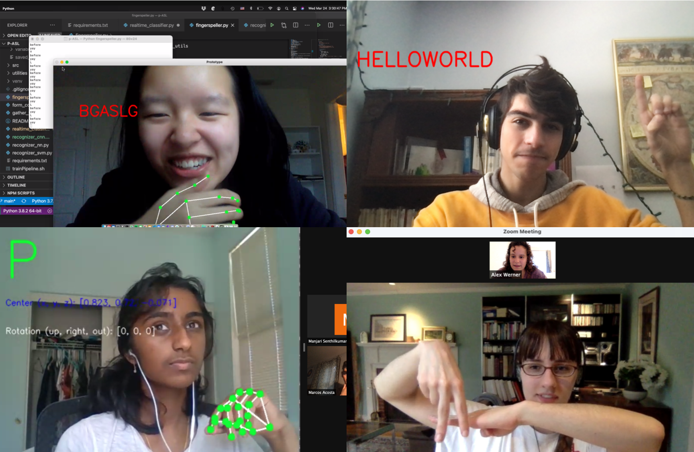
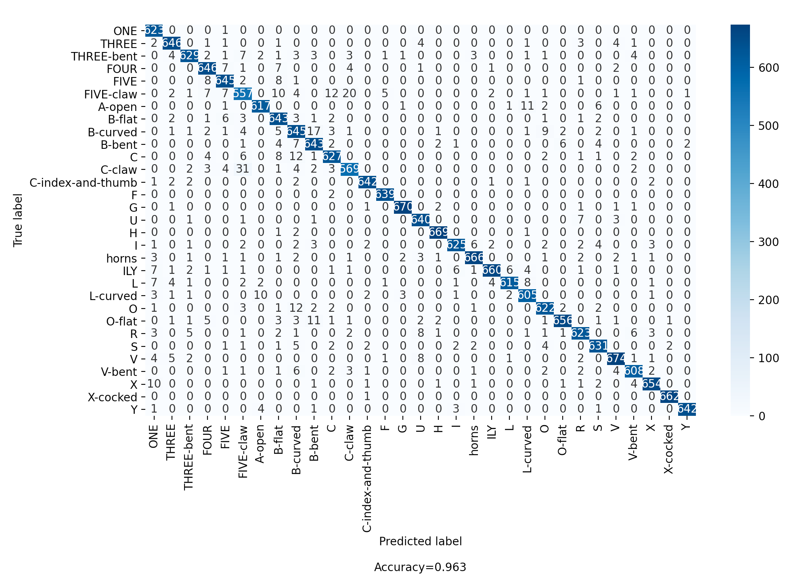
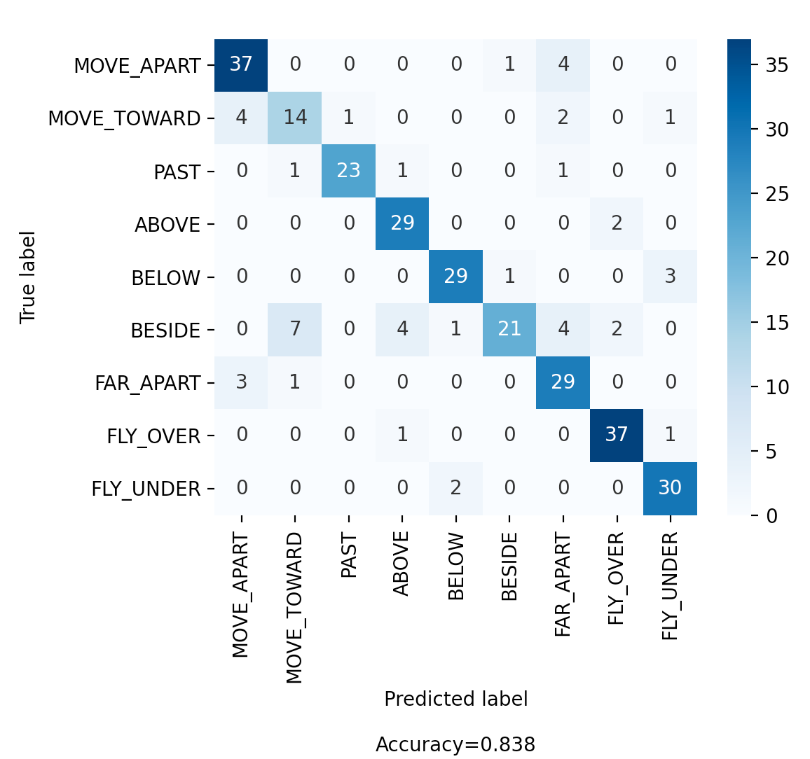
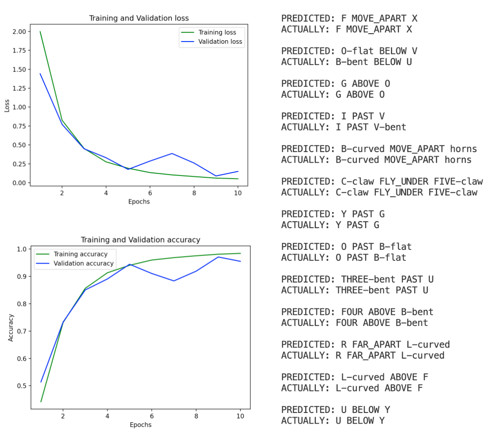

# p-ASL / Accounting for Visual Storytelling in Sign Language Recognition

## Purpose

Although it may sound obvious, a key distinction between sign languages and spoken languages is the visual aspect. One element of this is iconicity; using a handshape to visually represent an object, which can then be used to tell a short story (potentially about its relation to another object). As an example, a signer may sign `LAMP` and use one handshape (called a **classifier**) to represent the lamp, and then sign `TABLE` and use another classifier to represent the table, and then, combining both handshapes, visually place the lamp on the table. This communicates the fact that the lamp is on the table.

A flawed analogy made between spoken languages and signed languages is that sign languages consist of a series of atomic signs. This is not the case, and classifiers are an exemplary exception. The goal of this project is to demonstrate how deep learning can still be used to generalize from handshapes and motions between hands to recognize novel combinations of those handshapes and motions.

## Affiliation

_This project was pursued as a research project under Brown University's [ExploreCSR 2021](https://explorecsr.cs.brown.edu/) program. As a project lead in the Claremont College's ML/AI organization [P-ai](https://p-ai.org), I also took the opportunity to use this project as an introduction to machine learning for five amazing students._

<p align="center">
  
  <br />
  <i>Some members of p-ASL hard at work</i>
</p>

## Data collection

To reduce the complexity of the problem, we decided to create our own small-scale dataset. We used Google's [MediaPipe](https://google.github.io/mediapipe/solutions/holistic) to capture videos of each of us signing isolated signs that involved different classifiers and motions. For example, the [CL:A](https://www.lifeprint.com/asl101/pages-signs/c/cla.htm) handshape in the right hand approaching [CL:5](https://www.lifeprint.com/asl101/pages-signs/c/cl5.htm) in the left. We then augmented our data by mixing and matching different handshapes and motions. We used 31 classifier handshapes, and 9 motions:

```
MOVE_APART
MOVE_TOWARD
PAST
ABOVE
BELOW
BESIDE
FAR_APART
FLY_OVER
FLY_UNDER
```

There are `31 * 31 * 9 = 8,649` combinations of these handshapes and motions. Each combination is represented by an array with dimensionality `(100, 30, 130)`, representing 100 examples of 30 frames, each with 130 data points (each hand contains 21 3D points, plus an x-y coordinate; `2 * (21 * 3 + 2) = 130`).

This data is [available for download](https://drive.google.com/file/d/1etoDqwa1ZBZFSzixBUqWUkQDvRIXkfrX/view?usp=share_link).

## Baseline classification

To ensure that both handshapes and motions could be accurately identified, we trained simple models to classify each individually.

Random forests, SVMs, regular Neural Nets and CNNs were all able to classify the handshapes with relative ease, although the random forest and SVM took the longest to train. In order to ensure robustness, the handshape data was augmented by performing random rotations. The following is a confusion matrix of the classification results of the CNN on static handshapes:

<p align="center">
  
  <br />
  <i>Classification on static handshapes is very accurate and precise</i>
</p>
<br />

Additionally, we trained an LSTM on the nine possible motions to ensure that they could be learned. We saw similarly strong performance, although similar motions could be mistaken for one another.

<p align="center">
  
</p>

## Setup

To set up the classification task, we created labeled data from our generated dataset by choosing a very simple syntax for representing handshape + motion combinations. The syntax is as follows:

`<RIGHT HAND TOKEN> <MOTION TOKEN> <LEFT HAND TOKEN> <END>`

Our `X` data has the shape `(8649, 30, 130)`, as explained in the data collection section. The `y` data has shape `(8649, 3, 40)`, since there are three non-trivial tokens in a "sentence" and 40 tokens to choose from (31 handshapes and 9 motions). The data was split into training and validation with an 80/20 split. This way, there are no combinations in the validation set that were seen during training.

# Results

Using an LSTM-based encoder-decoder model, we were able to achieve 83.3% accuracy on unseen handshape + motion combinations.

<p align="center">
  
  <br />
  <i>Training and validation loss and accuracy, with examples</i>
</p>
<br />

We found this to be very impressive! Given raw data about key landmark points on the hands over time and given example "sentences", a relatively simple model architecture was able to learn to generalize the syntax to novel combinations after few training epochs.

# Replicating results

All requirements are listed in `requirements.txt` and can be installed via `pip install -r requirements.txt`. The encoder-decoder model runs in `train_encoder_decoder.py`. It expects to find `X.npy` and `y.npy` in `/data/holistic_data_synth/corpus/` (downloadable [here](https://drive.google.com/file/d/1etoDqwa1ZBZFSzixBUqWUkQDvRIXkfrX/view?usp=share_link)), but this path can easily be changed in the Python script. It should be sufficient to run `python train_encoder_decoder.py` to train and evaluate the model, and achieve the loss and accuracy plots shown above.
